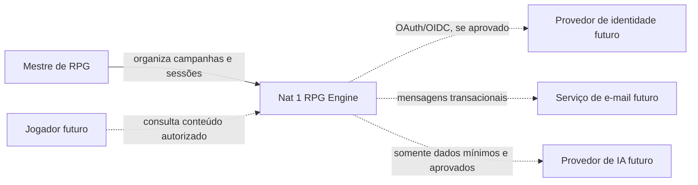
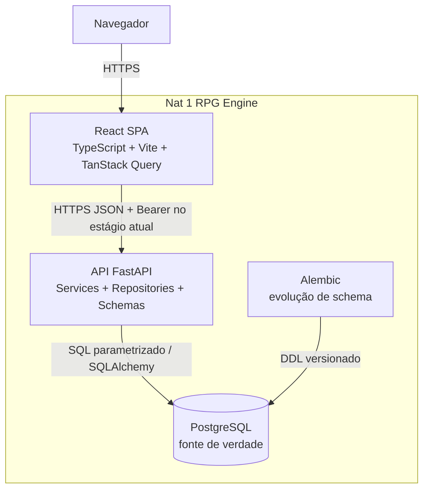
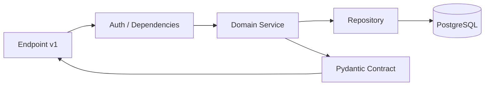
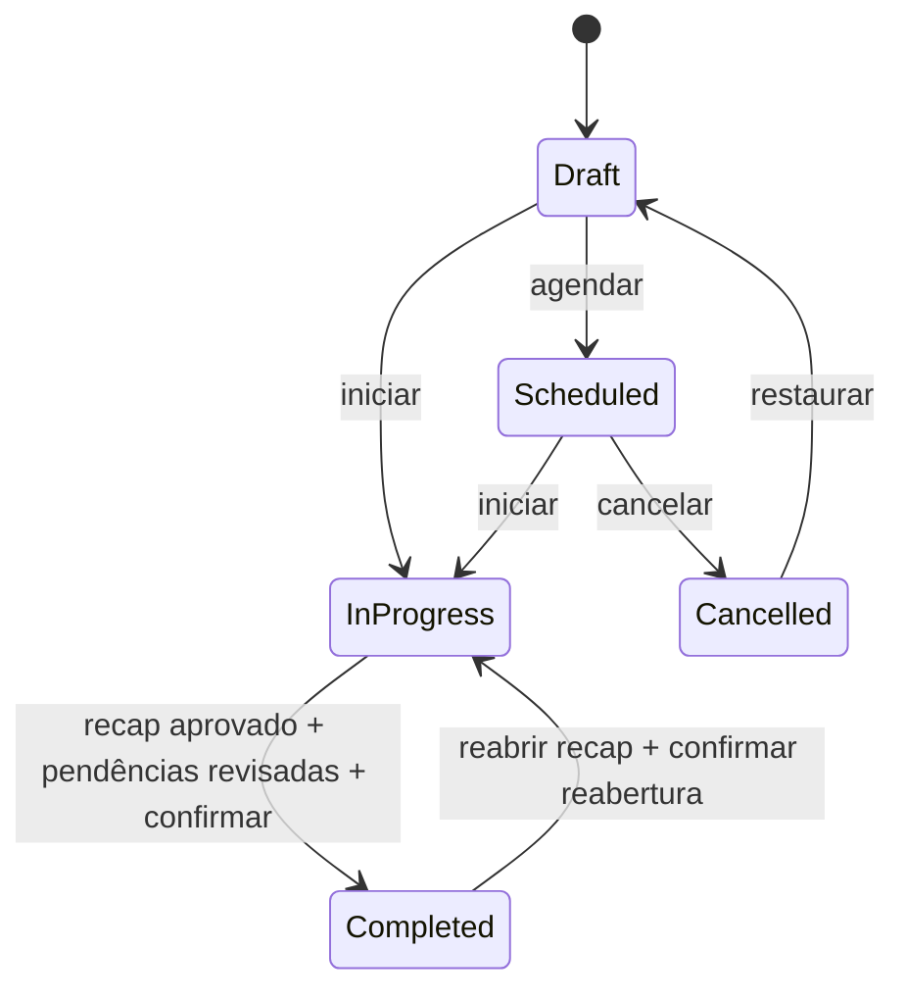
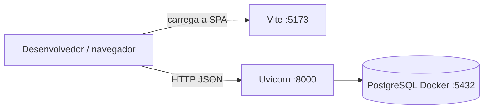
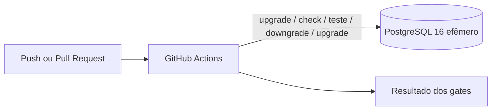
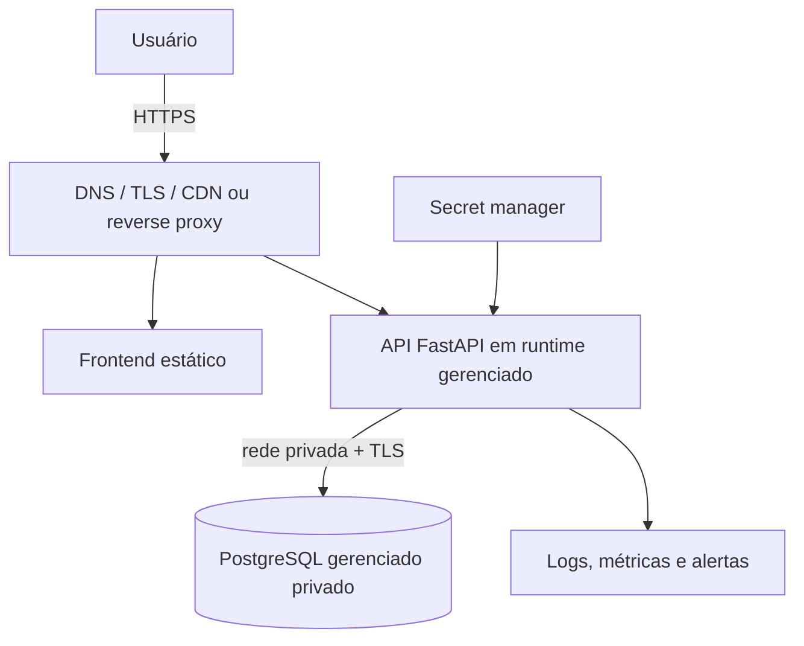

# Arquitetura C4 e Deployment

- Projeto: Nat 1 RPG Engine
- Versão: 1.0
- Data: 2026-07-18
- Status: arquitetura alvo incremental; produção ainda não implantada

## Premissas

- aplicação web responsiva para mestres de RPG;
- frontend React e API FastAPI evoluem como monólitos modulares separados;
- PostgreSQL é a fonte de verdade;
- autorização é aplicada na API, nunca confiada ao cliente;
- migrations Alembic são o único caminho de evolução do schema;
- uploads, analytics externos, filas e IA só entram após decisão e ameaça específica;
- componentes devem continuar substituíveis sem microserviços prematuros.

## C4 — Contexto



Linhas tracejadas representam integrações não implementadas. O MVP atual possui apenas
o mestre proprietário e autenticação própria.

## C4 — Containers



### Responsabilidades

| Container | Responsabilidade | Não deve conter |
| --- | --- | --- |
| React SPA | apresentação, rotas, estados assíncronos e validação de UX | regra final de autorização, secrets ou acesso direto ao banco |
| API FastAPI | autenticação, autorização, regra de negócio, contratos e auditoria | estado de UI ou consulta sem escopo de campanha |
| PostgreSQL | integridade relacional, persistência e constraints | regra dependente apenas de interface |
| Alembic | histórico linear e revisável do schema | criação ad hoc de tabelas em produção |

## Componentes lógicos da API



O vertical de sessão deve manter módulos por domínio:

```text
endpoints/sessions.py
services/session_service.py
repositories/session_repository.py
models/session.py
schemas/session.py
```

Cenas, acontecimentos, recap e pendências podem iniciar no mesmo bounded context de
continuidade de sessão. A separação física só ocorre quando responsabilidades e volume
justificarem.

## Fluxo de sessão



Regras invariantes devem permanecer no service e, quando possível, também em constraints
do banco. Transições inválidas retornam erro de domínio estável, não stack trace.

Uma sessão concluída com recap aprovado não volta diretamente a `in_progress`. O mestre
primeiro reabre explicitamente o recap, invalidando sua aprovação sem apagar conteúdo ou
timestamps de auditoria, e então confirma a reabertura da sessão. A transição é protegida
pela mesma autorização da campanha.

## Deployment local



O Vite atual não atua como proxy da API; a SPA no navegador chama diretamente a URL
configurada por `VITE_API_BASE_URL`.

- credenciais do Compose são exclusivamente locais;
- `.env` não é versionado;
- o banco padrão persistente não deve receber rollback destrutivo para validação;
- testes de reversibilidade usam container descartável e porta isolada.

## Deployment de CI



O CI possui dois jobs independentes:

- backend: dependências travadas, `pip check`, Ruff, Pytest, PostgreSQL, Alembic e auditoria;
- frontend: `npm ci`, ESLint, TypeScript, Vitest, build e auditoria npm.

## Deployment alvo de produção

Nenhum fornecedor está decidido. A topologia mínima esperada é:



Requisitos antes de exposição pública:

- TLS obrigatório e origens CORS explícitas, HTTPS e não-loopback fora de local/teste;
- secrets fora de imagem, repositório e logs;
- banco sem porta pública, backup e teste de restauração;
- migrations como etapa controlada, com uma única execução por release;
- health/readiness separados;
- rate limiting, headers, política de sessão e rotação de secret;
- logs estruturados sem token ou conteúdo narrativo;
- alertas de erro, latência, saturação e falha de migration;
- rollback de aplicação compatível com schema expand/contract quando necessário.

## Trust boundaries

| Fronteira | Dados atravessados | Controle mínimo |
| --- | --- | --- |
| Navegador → frontend/API | credenciais, token e conteúdo da campanha | HTTPS, CSP futura, validação, proteção XSS e sessão segura |
| API → PostgreSQL | dados pessoais e narrativos | rede privada, credencial exclusiva, TLS e menor privilégio |
| CI → serviços | código e metadados de dependência | permissões `contents: read`, secrets mínimos e dependências fixadas |
| API → fornecedor futuro | e-mail, arquivo, analytics ou prompt mínimo | DPA, minimização, consentimento/base legal e allowlist |

## Decisões de escalabilidade

- iniciar com monólito modular reduz custo operacional e mantém transações do vertical;
- escalar frontend, API e banco independentemente no nível de deployment;
- adicionar cache somente após métrica de gargalo;
- adicionar fila somente para trabalho assíncrono real, como e-mail ou processamento de arquivo;
- particionamento, read replicas e microserviços exigem evidência de volume;
- toda integração externa deve ter timeout, retry limitado, idempotência e circuito de falha adequado.

## Regras de evolução

1. Model novo exige migration e teste PostgreSQL.
2. Endpoint filho valida usuário, campanha e pertencimento do recurso.
3. Mudança incompatível de API deve ser versionada ou migrada em duas etapas.
4. Dados novos recebem classificação de privacidade e prazo de retenção.
5. Diagrama deve ser atualizado quando um container ou trust boundary for criado.
6. Estado planejado nunca deve ser documentado como implantado.
