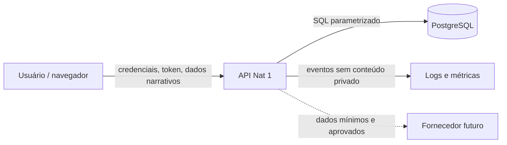

# Modelo de Ameaças, Autorização e LGPD

- Projeto: Nat 1 RPG Engine
- Versão: 1.0
- Data: 2026-07-18
- Status: baseline de arquitetura; revisão jurídica e operacional obrigatória antes do beta público

## Escopo

Este documento cobre conta, autenticação, campanhas, futuro vertical de sessões e cenas,
telemetria e integrações planejadas. Ele orienta engenharia e produto; não substitui
parecer jurídico sobre bases legais, contratos, termos ou operação como controlador e
operador.

## Ativos protegidos

- credenciais e hashes de senha;
- tokens e secrets de aplicação;
- nome e e-mail da conta;
- campanhas, notas, acontecimentos, recaps e pendências;
- conteúdo marcado como privado ou segredo do mestre;
- vínculos futuros entre campanhas e participantes;
- backups, logs, métricas e trilhas de auditoria;
- disponibilidade e integridade do histórico narrativo.

## Atores

- mestre proprietário autenticado;
- participante futuro autenticado;
- visitante não autenticado;
- atacante externo;
- usuário autenticado tentando acessar outra campanha;
- operador autorizado de infraestrutura;
- fornecedor futuro de e-mail, analytics, armazenamento ou IA.

## Diagrama de fluxo e fronteiras

Cada seta cruza uma trust boundary. Integrações tracejadas não estão autorizadas apenas
por aparecerem no diagrama.

## Modelo STRIDE

| Categoria | Cenário principal | Impacto | Controles atuais/planejados | Estado |
| --- | --- | --- | --- | --- |
| Spoofing | roubo ou falsificação de token | acesso à conta | `bcrypt_sha256`, migração oportunística de bcrypt legado, JWT expirável e secret por ambiente; cookies HttpOnly/refresh e rotação em fase própria | parcial |
| Tampering | alterar recurso de outra campanha | perda de integridade | escopo por proprietário, IDs UUID, testes IDOR e autorização backend | validada localmente nos recursos atuais; integração pendente |
| Repudiation | negar ação crítica | investigação insuficiente | timestamps atuais; audit log para mudança de papel, publicação e exclusão antes da colaboração | pendente |
| Information disclosure | XSS, log de token ou resposta excessiva | exposição pessoal/narrativa | schemas de saída, sem `dangerouslySetInnerHTML`, logs minimizados, headers; CSP e sessão avançada pendentes | parcial |
| Denial of service | brute force ou abuso de payload | indisponibilidade/custo | limites de schema; rate limiting, limites de corpo e observabilidade antes de produção | pendente |
| Elevation of privilege | participante vira editor/mestre | vazamento e alteração | deny-by-default, papéis por campanha, matriz de permissões e testes por ação | arquitetura definida |

## Riscos priorizados

### P0 — acesso cruzado entre campanhas

Todo repositório deve consultar recursos por `resource_id` e campanha autorizada, nunca
somente pelo ID filho. A resposta para recurso inexistente e não autorizado deve evitar
enumeração. Testes devem cobrir leitura e todas as mutações.

### P0 — exposição de conteúdo privado

Conteúdo narrativo não pode aparecer em analytics, logs, mensagens de erro ou payloads
de terceiros. O frontend não é fronteira de segurança para segredos do mestre.

### P1 — sessão no navegador

O access token atual em `localStorage` aumenta o impacto de XSS. Antes de exposição
pública, deve haver decisão registrada entre:

- cookie `HttpOnly`, `Secure` e `SameSite`, com proteção CSRF quando aplicável; ou
- Bearer de curta duração com armazenamento mais restrito e renovação segura.

Refresh token, rotação, revogação e encerramento de sessões exigem fase e testes próprios.

### P1 — abuso de autenticação

Login e cadastro precisam de rate limiting, monitoramento e resposta uniforme. E-mail
inexistente deve executar verificação de hash dummy para reduzir enumeração temporal.
Novos hashes usam `bcrypt_sha256` e aceitam no máximo 128 caracteres. Login válido com
bcrypt legado deve regravar o hash; entrada legada acima de 72 bytes é recusada com a
mesma resposta genérica e dependerá do futuro fluxo seguro de reset.

### P1 — configuração insegura

`ENVIRONMENT`, `DATABASE_URL` e `SECRET_KEY` devem ser explícitos. Ambiente não local
rejeita secret curto/placeholder, a URL com credenciais locais documentadas e qualquer
origem CORS sem HTTPS ou com host loopback. Produção requer TLS, banco e secrets
gerenciados e rotação documentada.

### P2 — dependência e supply chain

Locks, `npm ci`, auditorias, revisão de updates e permissões mínimas do CI são obrigatórios.
Resultados de auditoria não autorizam update automático sem teste e revisão.

## Modelo de autorização por campanha

### Estado atual

- único papel efetivo: `owner`;
- `GameProject.owner_user_id` define acesso;
- recursos filhos herdam autorização pela campanha;
- templates built-in são globais somente para leitura conforme regra específica.

### Modelo futuro

Entidade proposta: `CampaignMembership`.

Esta matriz é a autorização mínima testável do primeiro modelo colaborativo. Cada célula
é binária de propósito; permissões finas só podem ser adicionadas por decisão técnica,
migration, contrato de API e testes próprios.

| Papel | Ler metadados privados | Ler conteúdo `campaign` | Ler conteúdo `master` | Criar/editar sessão | Aprovar/reabrir recap | Gerir membros | Alterar propriedade ou excluir campanha |
| --- | --- | --- | --- | --- | --- | --- | --- |
| `owner` | sim | sim | sim | sim | sim | sim | sim |
| `game_master` | sim | sim | sim | sim | sim | não | não |
| `editor` | sim | sim | não | sim | não | não | não |
| `player` | sim | sim | não | não | não | não | não |
| `viewer` | sim | sim | não | não | não | não | não |

Regras:

- ausência de membership significa acesso negado;
- papel é avaliado pela API a cada ação sensível;
- conteúdo possui visibilidade própria quando necessário: `master`, `campaign`, `public`;
- `public` só permite acesso sem membership depois de existir publicação explícita; publicação
  permanece fora do MVP vertical e campanha privada continua deny-by-default;
- permissão de conteúdo nunca pode ampliar o papel administrativo;
- transferência de propriedade exige reautenticação e audit log;
- convites expiram, são uso único e não expõem se um e-mail já possui conta;
- remoção de membro revoga acesso e sessões relacionadas conforme política futura.

Critérios de teste quando `CampaignMembership` entrar no gate autorizado:

- para cada célula `sim`, provar sucesso no endpoint e no service correspondente;
- para cada célula `não`, provar resposta uniforme sem vazamento de existência do recurso;
- repetir leitura e mutações com UUID pertencente a outra campanha para cobrir IDOR;
- provar que trocar `campaign_id` no payload não move recurso entre campanhas;
- provar que remover ou rebaixar membership invalida a autorização na requisição seguinte;
- testar owner atual separadamente: o modelo futuro não reduz a proteção já existente.

## Inventário inicial de dados

| Categoria | Exemplos | Finalidade | Sensibilidade | Retenção proposta |
| --- | --- | --- | --- | --- |
| Conta | nome, e-mail, status | autenticação e prestação do serviço | dado pessoal | enquanto conta ativa e período operacional/legal definido |
| Credencial | hash de senha | autenticação | alta | até troca/exclusão; nunca exportar hash |
| Campanha | título, conteúdo, recaps | funcionalidade contratada | privada, pode conter dados de terceiros | até exclusão solicitada, com janela de recuperação definida |
| Membership futura | papel, convite, participação | colaboração e autorização | pessoal | vínculo ativo mais trilha mínima de segurança |
| Telemetria | IDs pseudonimizados, ação, erro | produto e confiabilidade | baixa a moderada | janela curta e documentada |
| Logs | request ID, código de erro, latência | segurança e operação | pode se tornar sensível | retenção mínima, acesso restrito e redaction |
| Backup | cópia criptografada | continuidade e recuperação | mesma sensibilidade da origem | ciclo fechado e expiração automática |

Conteúdo criado pelo usuário pode conter dados pessoais de terceiros. O onboarding e os
termos devem orientar minimização e proibir uso indevido, sem presumir que todo nome de
personagem fictício é dado pessoal.

## Privacy by design

- coletar somente dados necessários ao fluxo ativo;
- não usar conteúdo narrativo para analytics;
- separar ambientes e excluir contas internas das métricas;
- pseudonimizar identificadores analíticos;
- consentimento não deve ser usado como base genérica quando outra base for adequada;
- ferramenta externa exige inventário, finalidade, região, suboperadores e contrato;
- configurações privadas devem ser padrão para campanhas e recaps;
- exportação deve preceder exclusão definitiva quando solicitada;
- exclusão deve alcançar dados ativos e expirar em backups pelo ciclo documentado;
- nenhuma IA treina ou processa conteúdo sem política, transparência e autorização explícita.

## Direitos e operação LGPD

Antes do beta público, definir canal e procedimento para:

- confirmação de tratamento e acesso;
- correção de dados de conta;
- portabilidade/exportação em formato utilizável;
- anonimização, bloqueio ou eliminação quando aplicável;
- informação sobre compartilhamentos e fornecedores;
- revogação de consentimento onde essa for a base adotada;
- contestação e revisão de decisões automatizadas, caso existam.

Também devem ser definidos controlador, operadores, encarregado/canal, registro de
operações, bases legais por finalidade e prazos. Essas decisões exigem validação jurídica.

## Retenção, exportação e exclusão

- arquivamento de campanha é reversível e diferente de exclusão;
- exclusão de conta/campanha deve usar confirmação forte e período de recuperação claro;
- exportação mínima deve incluir estrutura, conteúdo e relacionamentos em formato aberto;
- backups têm retenção finita e restauração controlada;
- audit logs de segurança podem ter retenção distinta, minimizada e justificada;
- dados agregados realmente anonimizados podem sobreviver, sem reidentificação prática.

## Incidentes

Plano mínimo antes de produção:

1. detectar e preservar evidências sem copiar conteúdo desnecessário;
2. conter credencial, sessão, origem ou integração afetada;
3. avaliar natureza, volume, titulares e impacto;
4. corrigir, rotacionar secrets e validar restauração;
5. decidir notificações regulatórias e aos titulares com apoio jurídico;
6. registrar causa, linha do tempo e ações preventivas.

## Critérios de saída para beta público

- threat model revisado após o vertical;
- política de sessão pública implementada;
- rate limiting e limites de payload;
- CORS e headers verificados no ambiente real;
- matriz de autorização testada, mesmo que apenas `owner`;
- inventário de dados, fornecedores e retenção aprovado;
- exportação e exclusão com procedimento documentado;
- backups e restauração testados;
- observabilidade sem secrets ou conteúdo narrativo;
- política de privacidade e termos revisados por profissional competente;
- processo de incidente exercitado ao menos em tabletop.

## Referências primárias

Consulta realizada em 2026-07-18. Estas fontes orientam o desenho técnico, mas não
substituem validação jurídica do produto, das bases legais e dos procedimentos reais:

- [Lei nº 13.709/2018 — LGPD, texto compilado no Planalto](https://www.planalto.gov.br/ccivil_03/_ato2015-2018/2018/lei/l13709compilado.htm);
- [Direitos dos titulares — ANPD](https://www.gov.br/anpd/pt-br/assuntos/titular-de-dados-1/direito-dos-titulares);
- [Regulamentações vigentes da ANPD](https://www.gov.br/anpd/pt-br/acesso-a-informacao/institucional/atos-normativos/regulamentacoes_anpd), incluindo o Regulamento de Comunicação de Incidente de Segurança.
